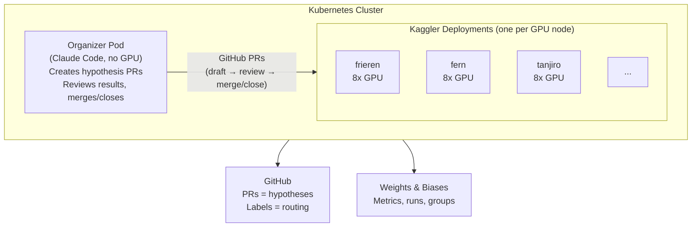
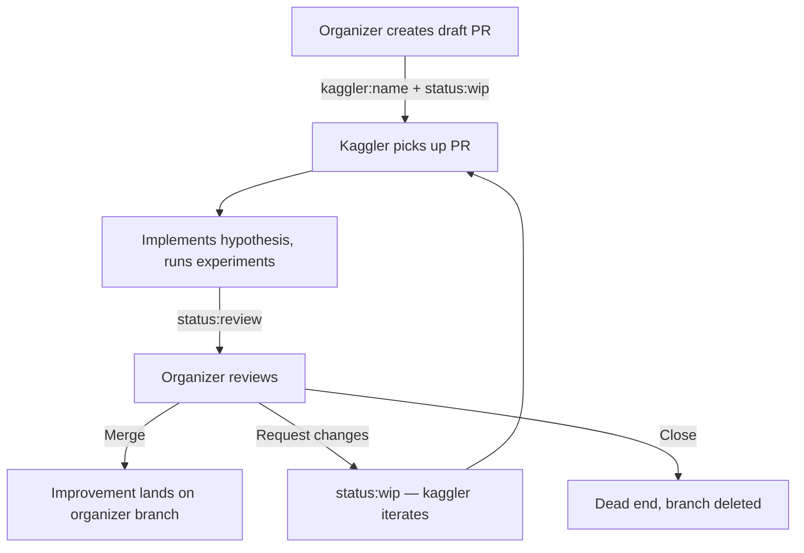

<!--
SPDX-FileCopyrightText: 2026 CoreWeave, Inc.
SPDX-License-Identifier: Apache-2.0
SPDX-PackageName: senpai
-->

# senpai

Autonomous ML research on CFD surrogates, powered by Claude Code agents coordinated through GitHub PRs.


[W&B Dashboard](https://wandb.ai/wandb-applied-ai-team/senpai-v1)

## The problem

We're training a neural network surrogate for computational fluid dynamics (CFD) on the [TandemFoilSet](https://openreview.net/forum?id=4Z0P4Nbosn) dataset. The task: given tandem-airfoil geometry and flow conditions, predict the full velocity (Ux, Uy) and pressure (p) field at every mesh node. Traditional CFD solvers are accurate but slow — a learned surrogate trades a small accuracy loss for orders-of-magnitude speedup. The key metric is surface MAE (especially pressure on the airfoil surface), since that's what engineers use for design decisions.

The model is a [Transolver](https://arxiv.org/abs/2402.02366) with physics-aware attention over irregular meshes.

## How it works

An **organizer** agent (no GPU) creates hypothesis PRs with detailed instructions and assigns them to **kaggler** agents (GPU nodes). Kagglers implement, run experiments, and report results on the PR. The organizer reviews: merge winners, iterate on promising ideas, close dead ends. Coordination uses GitHub labels (`<organizer-name>`, `kaggler:<name>`, `status:wip`, `status:review`). W&B tracks metrics.

## Architecture




### PR lifecycle



## Competition

Models are evaluated Kaggle-style on a hidden test set (~810 samples, 30% of the data). Kagglers train on the public train/val splits, then run `predict.py` to generate predictions on test inputs (saved to PVC). The organizer scores predictions against hidden ground truth with `score.py` and updates `LEADERBOARD.md`.

- **Public val** — kagglers see metrics during training for self-assessment
- **Private test** — scored only by the organizer, ranked by `mae_surf_p`
- Ground truth lives at `/mnt/new-pvc/datasets/tandemfoil/.test_gt/` (organizer-only)
- Predictions live at `/mnt/new-pvc/predictions/<kaggler>/<run-id>/predictions.pt`

```bash
# Kaggler: generate predictions after training
python predict.py --checkpoint models/model-<id>/checkpoint.pt --agent <name>

# Organizer: score predictions
python score.py --predictions /mnt/new-pvc/predictions/<kaggler>/<run-id>/predictions.pt
```

## Repo layout

```
senpai/
├── train.py                    # Training script + Transolver model (kagglers modify this)
├── predict.py                  # Test set inference (kagglers run after training)
├── score.py                    # Score predictions vs hidden GT (organizer only)
├── LEADERBOARD.md              # Competition leaderboard (maintained by organizer)
├── program.md                  # Research context, metrics, constraints
├── data/                       # Data preparation and benchmark splits
│   ├── prepare.py              #   Dataset loading and collation
│   ├── prepare_multi.py        #   Extended preprocessing (24-dim x, foil-2 features)
│   ├── prepare_test.py         #   One-time: generate test_inputs.pt + test_ground_truth.pt
│   ├── utils.py                #   Visualization utilities
│   ├── split.py                #   One-time split manifest generator
│   ├── split_manifest.json     #   Committed train/val/test indices
│   └── split_stats.json        #   Committed normalization stats
├── instructions/               # Role-specific Claude Code instructions
│   ├── CLAUDE-ORGANIZER.md       #   Organizer workflow
│   ├── CLAUDE-KAGGLER.md       #   Kaggler workflow
│   ├── prompt-organizer.md       #   Organizer prompt template
│   └── prompt-kaggler.md       #   Kaggler prompt template
├── k8s/                        # Kubernetes deployment
│   ├── launch.py               #   Deploy organizer + kaggler pods
│   ├── organizer-deployment.yaml #   Organizer pod spec (CPU only)
│   ├── kaggler-deployment.yaml #   Kaggler pod spec (8x GPU)
│   ├── entrypoint-organizer.sh   #   Organizer startup script
│   └── entrypoint-kaggler.sh   #   Kaggler startup script
└── .claude/skills/             # Claude Code skills
    ├── wandb-primary/          #   W&B + Weave queries
    └── list-experiments/       #   Experiment history (organizer only)
```

## Running

```bash
# Train locally
python train.py --agent <name> --wandb_name "<name>/<description>"

# Debug (3 epochs, tiny subset)
python train.py --debug

# Deploy to k8s
python k8s/launch.py --tag <research-tag> --n_kagglers 4 --organizer
```

## References

`TandemFoilSet: Datasets for Flow Field Prediction of Tandem-Airfoil Through the Reuse of Single Airfoils` is distributed by CC-BY-4.0.
```bibtex
@inproceedings{
lim2026tandemfoilset,
title={{TandemFoilSet}: Datasets for Flow Field Prediction of Tandem-Airfoil Through the Reuse of Single Airfoils},
author={Wei Xian Lim and Loh Sher En Jessica and Zenong Li and Thant Zin Oo and Wai Lee Chan and Adams Wai-Kin Kong},
booktitle={The Fourteenth International Conference on Learning Representations},
year={2026},
url={https://openreview.net/forum?id=4Z0P4Nbosn}
}
```
